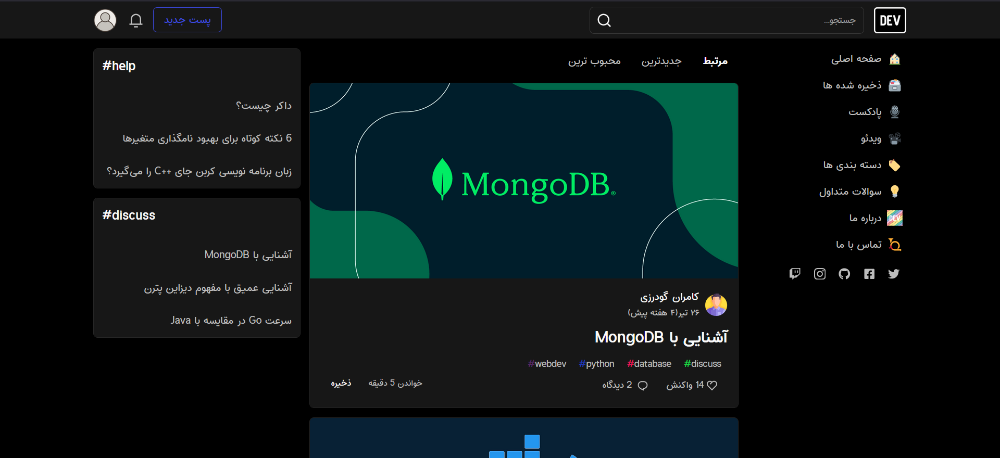
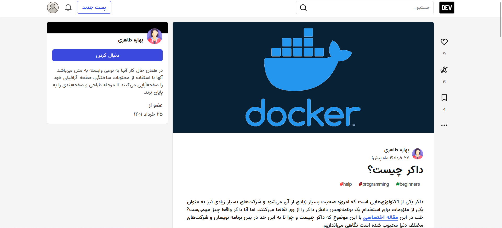

# Dev Community clone

a programming blog inspired by [dev.to](https://dev.to/).

---

## Description

challenge of this project was to create a fullstack crud blog using react, redux, typescript,firebase and firestore.
main goal of this project was to develop my communication skills with backend server, and also get started with typescript.

## Features

- authentication using firebase
- create post using tiptap WYSIWYG editor and upload to firestore
- create and update user profile
- react to a post (like a post, post a comment)
- fetch posts from firestore
- light/dark theme

> Note that in order to connect to the firebase for authentication, and firestore to upload/fetch posts vpn connection & healthy network connection is required.

## Installation

`npm install && npm start`

## Author

[Mohammdad sina kazemi](https://github.com/m-sina-k/).
